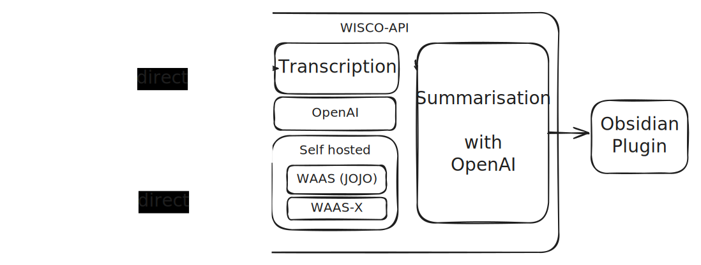

<!-- Improved compatibility of back to top link: See: https://github.com/othneildrew/Best-README-Template/pull/73 -->
<a name="readme-top"></a>
<!--
*** Thanks for checking out the Best-README-Template. If you have a suggestion
*** that would make this better, please fork the repo and create a pull request
*** or simply open an issue with the tag "enhancement".
*** Don't forget to give the project a star!
*** Thanks again! Now go create something AMAZING! :D
-->


<!-- PROJECT SHIELDS -->
<!--
*** I'm using markdown "reference style" links for readability.
*** Reference links are enclosed in brackets [ ] instead of parentheses ( ).
*** See the bottom of this document for the declaration of the reference variables
*** for contributors-url, forks-url, etc. This is an optional, concise syntax you may use.
*** https://www.markdownguide.org/basic-syntax/#reference-style-links
-->
[![Issues][issues-shield]][issues-url]
[![MIT License][license-shield]][license-url]


<!-- PROJECT LOGO -->
<br />
<div align="center">
  <a href="https://github.com/nilswenning/WISC-O">
    
  </a>

<h3 align="center">WISC-O</h3>

  <p align="center">
    A self-hosted Summarizing api
    <br />
    <a href="https://github.com/nilswenning/WISC-O/wiki"><strong>Explore the docs »</strong></a>
    <br />
    <br />
    <a href="https://github.com/nilswenning/WISC-O/issues/new?labels=bug&template=bug-report---.md">Report Bug</a>
    ·
    <a href="https://github.com/nilswenning/WISC-O/issues/new?labels=enhancement&template=feature-request---.md">Request Feature</a>
  </p>
</div>


<!-- TABLE OF CONTENTS -->
<!-- TABLE OF CONTENTS -->
<details>
  <summary>Table of Contents</summary>
  <ol>
    <li>
      <a href="#about-the-project">About The Project</a>
    </li>
    <li>
      <a href="#features">Features</a>
    </li>
    <li>
      <a href="#getting-started">Getting Started</a>
      <ul>
        <li><a href="#prerequisites">Prerequisites</a></li>
        <li><a href="#installation">Installation</a></li>
        <li><a href="#environment-variables">Environment Variables</a></li>
      </ul>
    </li>
    <li><a href="#roadmap">Roadmap</a></li>
    <li><a href="#contributing">Contributing</a></li>
    <li><a href="#license">License</a></li>
    <li><a href="#contact">Contact</a></li>
    <li><a href="#acknowledgments">Acknowledgments</a></li>
  </ol>
</details>


<!-- ABOUT THE PROJECT -->
## About The Project



WISC-O stands for WhIsper Summarisation to Obsidian(idk yet) . 
WISC-O is a API that accepts audio or a YT-link and summarizes the content of the audio.
After that it can be downloaded automatically downloaded with a Obsidian plugin.
Because the transcription is the most expressive process you can choose between OpenAI or a 
Self-Hosted solution reduce cost by a huge factor. 


### Features:
* Accepts 
  * Audio file
  * YouTube Link
* User can choose transcription service
  * Whisper-OpenAi
  * [WAAS](https://github.com/schibsted/WAAS)
  * WAAS-X 
    * Self-hosted Whisper-X service
    * Not yet released
* Supports different users
  * So you can share it with your family and friends
  * Each user has a Quota so you the dont deplete your OpenAI credit
* iOS App (Basic function done but not released yet)
* Obsidian-Sync-Plugin

<p align="right">(<a href="#readme-top">back to top</a>)</p>


<!-- GETTING STARTED -->
## Getting Started

The easiest way to start is with a docker image. 
If you dont have it installed you get it here: 
[Get Docker](https://docs.docker.com/get-docker/)


### Prerequisites

An OpenAI Key is mandatory to use this API\
Get It Here: <https://platform.openai.com/api-keys>

### Installation

1. Clone the repo
    ```sh
    git clone https://github.com/nilswenning/WISC-O
    ```
2. change your settings in the `docker-compose.yml`
3. Run the docker Container
    ```sh
    sudo docker compose up -d --build
    ```
4. `{"detail":"Not Found"}` should pop up if you visit http://your-ip:8000

<p align="right">(<a href="#readme-top">back to top</a>)</p>

### Environment Variables


| Environment Variable  | Required/Optional | Description                                                |
| --------------------- | ----------------- | ---------------------------------------------------------- |
| `OPENAI_API_KEY`      | Required          | OpenAI Key                                                 |
| `admin_email`         | Required          | Admin user's email address                                 |
| `admin_password`      | Required          | Admin user's password                                      |
| `admin_api_key`       | Required          | Admin user's API key                                       |
| `redis_host`          | Optional          | Redis server Required if address is not localhost          |
| `JOJO_BASE_URL`       | Optional          | Base URL for JOJO service                                  |
| `JOJO_AUTH_USER`      | Optional          | Username for JOJO service authentication                   |
| `JOJO_AUTH_PASSWORD`  | Optional          | Password for JOJO service authentication                   |
| `JOJO_WEBHOOK_ID`     | Optional          | Webhook ID for JOJO service                                |
| `WAASX_BASE_URL`      | Optional          | Base URL for WAASX service                                 |
| `WAASX_AUTH_USER`     | Optional          | Username for WAASX service authentication                  |
| `WAASX_AUTH_PASSWORD` | Optional          | Password for WAASX service authentication                  |
| `gpt_model`           | Optional          | Default GPT model to be used Default: `gpt-3.5-turbo-0125` |


<!-- ROADMAP -->
## Roadmap

- [x] Basic OpenAI-Flow
- [x] Added Self-Hosted Transcription Services
- [x] Added Users
    - [ ] User Manegment
- [ ] Add ollama Support (self-hosted Chat-GPT alternative)

See the [open issues](https://github.com/nilswenning/WISC-O/issues) for a full list of proposed features (and known issues).

<p align="right">(<a href="#readme-top">back to top</a>)</p>


<!-- CONTRIBUTING -->
## Contributing

Contributions are what make the open source community such an amazing place to learn, inspire, and create. Any contributions you make are **greatly appreciated**.

If you have a suggestion that would make this better, please fork the repo and create a pull request. You can also simply open an issue with the tag "enhancement".
Don't forget to give the project a star! Thanks again!

1. Fork the Project
2. Create your Feature Branch (`git checkout -b feature/AmazingFeature`)
3. Commit your Changes (`git commit -m 'Add some AmazingFeature'`)
4. Push to the Branch (`git push origin feature/AmazingFeature`)
5. Open a Pull Request

<p align="right">(<a href="#readme-top">back to top</a>)</p>


<!-- LICENSE -->
## License

Distributed under the MIT License. See `LICENSE.txt` for more information.

<p align="right">(<a href="#readme-top">back to top</a>)</p>


<!-- CONTACT -->
## Contact

Nils Wenning - nils@nilswe.de

Project Link: [https://github.com/nilswenning/WISC-O](https://github.com/nilswenning/WISC-O)

<p align="right">(<a href="#readme-top">back to top</a>)</p>


<!-- ACKNOWLEDGMENTS -->
## Acknowledgments

* [WAAS by Schibsted](https://github.com/schibsted/WAAS)
  * They bought me on the idea
* [m-bain with WhisperX](https://github.com/m-bain/whisperX)

<p align="right">(<a href="#readme-top">back to top</a>)</p>


<!-- MARKDOWN LINKS & IMAGES -->
<!-- https://www.markdownguide.org/basic-syntax/#reference-style-links -->
[contributors-shield]: https://img.shields.io/github/contributors/nilswenning/WISC-O.svg?style=for-the-badge
[contributors-url]: https://github.com/nilswenning/WISC-O/graphs/contributors
[forks-shield]: https://img.shields.io/github/forks/nilswenning/WISC-O.svg?style=for-the-badge
[forks-url]: https://github.com/nilswenning/WISC-O/network/members
[stars-shield]: https://img.shields.io/github/stars/nilswenning/WISC-O.svg?style=for-the-badge
[stars-url]: https://github.com/nilswenning/WISC-O/stargazers
[issues-shield]: https://img.shields.io/github/issues/nilswenning/WISC-O.svg?style=for-the-badge
[issues-url]: https://github.com/nilswenning/WISC-O/issues
[license-shield]: https://img.shields.io/github/license/nilswenning/WISC-O.svg?style=for-the-badge
[license-url]: https://github.com/nilswenning/WISC-O/blob/master/LICENSE.txt
